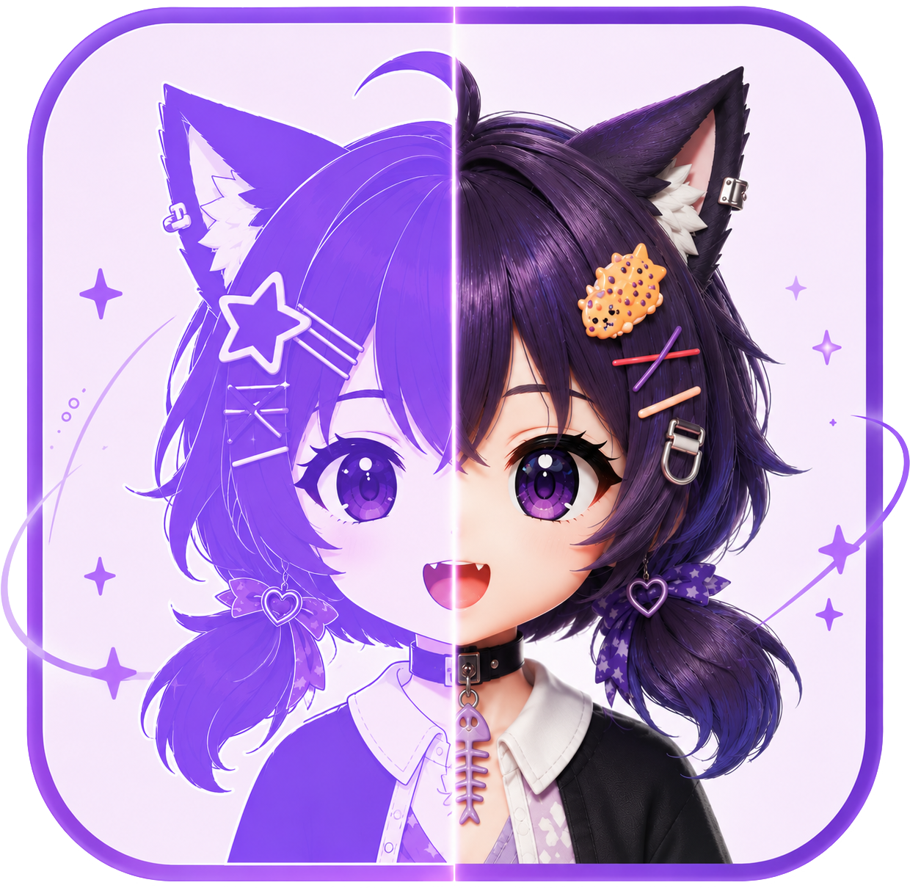
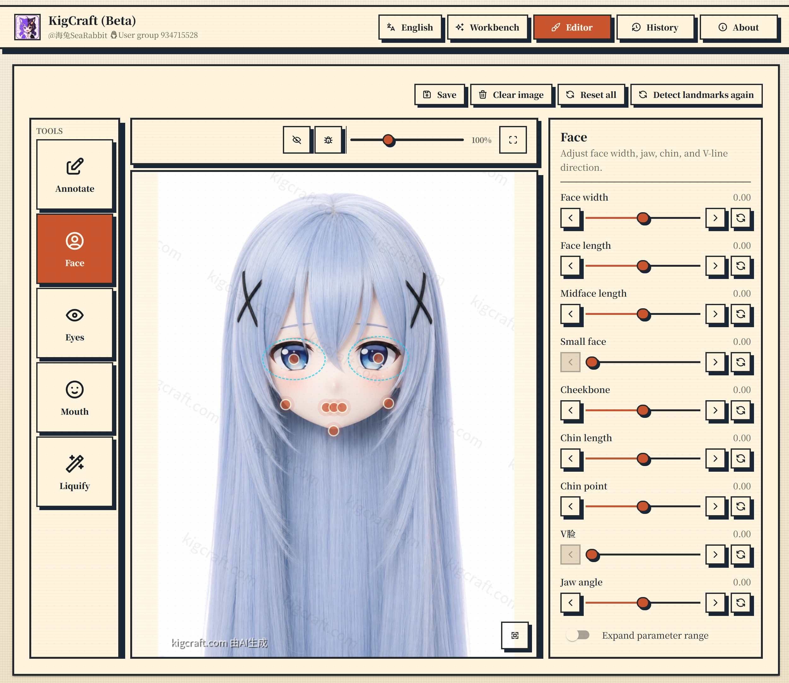

# KigCraft

[中文](README.zh-CN.md) | English

<p align="center">
  
</p>

KigCraft is a web tool for making Kigurumi head-shell preview images from character references. The workflow follows the way a maker usually works: upload references, confirm the important head details, generate a front view, edit it, and then produce a four-view sheet.

Developer: SeaRabbit / 海兔  
User group: QQ 934715528



## Features

- Upload character references and add a short note about what should stay unchanged.
- Review an editable detail list before generation, including hair, eyes, expression, ears, and head accessories.
- Generate front-view and four-view previews through a pluggable generation provider.
- Edit generated images with annotation, landmark correction, face shape, eyes, mouth, liquify, and local regeneration tools.
- Switch between Chinese, English, and Japanese UI modes. The app can also choose the default language from the browser.
- Run the local stack with Docker Compose, FastAPI, React, Postgres, Redis, and MinIO.

## License

KigCraft is released under GPL-3.0-or-later. See [LICENSE](LICENSE).

## Requirements

- Docker Desktop or Docker Engine with Compose
- Node.js 22 or newer for frontend-only development
- Python 3.12 or newer for backend-only development
- Codex CLI authentication when `GENERATION_PROVIDER=codex`

## Quick start

```powershell
Copy-Item .env.example .env
# Edit .env and replace every change-me-* value before exposing the service.
docker compose up --build
```

Before using Codex generation, create `ref/` at the repo root and add your own product reference images. See [Product reference images](#product-reference-images).

Local URLs:

- Frontend: <http://localhost:15173>
- API health: <http://localhost:18000/health>
- MinIO console: <http://localhost:19001>

## Generation providers

`GENERATION_PROVIDER=codex` runs generation through the Codex CLI inside the backend container. Mount an authenticated Codex config directory at runtime:

```powershell
Copy-Item -Recurse "$env:USERPROFILE\.codex" ".\runtime\codex-home"
docker compose up --build
```

For a Linux server, copy an authenticated Codex config directory to the host and set:

```dotenv
GENERATION_PROVIDER=codex
CODEX_PATH=codex
CODEX_CONFIG_DIR=/home/deploy/.codex
CODEX_PRODUCT_REFERENCE_PATH=ref/product-reference.png
```

### Product reference images

This repository does not ship product reference images. You need to create `ref/` yourself and place your own files there before running Codex generation.

| File | Purpose |
| --- | --- |
| `ref/product-reference.png` | Finished-product style reference for front-view generation |
| `ref/turnaround-reference.png` | Finished-product style reference for four-view generation |

Use PNG files with the exact filenames above., such as studio background, shell material, wig texture, framing, and lighting. They are not the character reference images uploaded through the UI.

`ref/` is listed in `.gitignore`, so private reference assets stay on your machine and are not committed to Git.

```powershell
New-Item -ItemType Directory -Force ref
# Copy your own reference images into ref/
```

Override the front-view reference path in `.env` if needed:

```dotenv
CODEX_PRODUCT_REFERENCE_PATH=ref/product-reference.png
```

`GENERATION_PROVIDER=codex_bridge` runs the Codex CLI outside the backend container. Start the bridge with:

```powershell
.\tools\start_codex_bridge.ps1
```

Use a custom `CODEX_BRIDGE_TOKEN` outside local development.

Fixture and mock generation are for tests and local smoke runs only. Do not enable them in production.

## Deployment

Create a production `.env` on the server before deploying. At minimum, set:

- `APP_ENV=production`
- Strong values for `POSTGRES_PASSWORD`, `MINIO_ROOT_PASSWORD`, `JWT_SECRET`, and `ADMIN_AUDIT_PASSWORD`
- Production `CORS_ALLOWED_ORIGINS`
- `GENERATION_PROVIDER=codex` or `codex_bridge`
- `ALLOW_FIXTURE_GENERATION=false`

Deploy the current Git commit over SSH:

```powershell
.\scripts\deploy-ssh.ps1 `
  -KeyPath "$env:USERPROFILE\.ssh\id_ed25519" `
  -SshTarget "deploy@example.com" `
  -RemoteAppDir "/opt/kigcraft"
```

The script uploads a `git archive`, extracts it on the server, checks that production is not using fixture generation, and rebuilds `api`, `worker`, and `frontend` with Docker Compose.

## Development

Frontend:

```powershell
cd frontend
npm install
npm run dev
npm run build
```

Backend:

```powershell
cd backend
python -m venv .venv
.\.venv\Scripts\python -m pip install -e .[dev]
.\.venv\Scripts\python -m pytest
```
